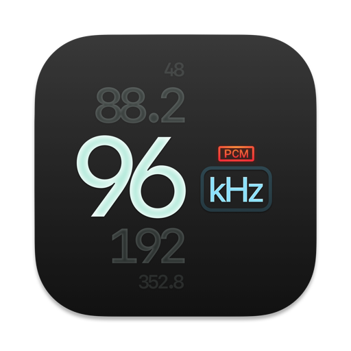

<p align="center">
  

</p>

#  

LosslessMusic switches your current audio device's sample rate to match the currently playing lossless song on your Apple Music app, automatically.

Let's say if the next song that you are playing, is a Hi-Res Lossless track with a sample rate of 192kHz, LosslessMusic will switch your device to that sample rate as soon as possible. 

The opposite happens, when the next track happens to have a lower sample rate. 

Note, some DAC on MacOS 15.4(Sequoa) might missing the 16-bits depths, so for those musics, there is no bit-perfect playback.

## Installation
Drag the app to your Applications folder. If you wish to have it running when logging in, you should be able to add LosslessMusic in System Settings:

```
> User & Groups > Login Items > Add LosslessMusic app
```

## App details

There isn't much going on, when it comes to the UI of the app, as most of the logic is to:
1. Read Apple Music's logs to know the song's sample rate.
2. Set the sample rate to the device that you are currently playing to.


As such, the app lives on your menu bar. The screenshot above shows it's only UI component that it offers, which is to show the sample rate that it has parsed from Apple Music's logs.


If you wish, the sample rate can also be directly visible as the menu bar item.


Do also note that:
- There may be short interuptions to your audio playback, during the time where the app attempts to switch the sample rates.
- Prolonged use on MacBooks may accelerate battery usages, due to the frequent querying of the latest sample rate.

Bit Depth switching is also supported, although, enabling it will reduce detection accuracy, hence, it is not recommended.

### Why make this?
Ever since Apple Music Lossless launched along with macOS 11.4, the app would never switch the sample rates according to the song that was playing. A trip down to the Audio MIDI Setup app was required.
This still happens today, with macOS 12.3.1, despite iOS's Music app having such an ability.

I think this improvement might be well appreciated by many, hence this project is here, free and open source.

## Prerequisites
Due to how the app works, this app is not, and cannot be sandboxed.
It also has the following requirement, due to the use of `OSLog` API: 
- The user running LosslessMusic must be an **admin**. This is not tested and assumed due to this [Apple Developer Forums thread](https://developer.apple.com/forums/thread/677068).
- Apple Music app must have Lossless mode on. (well, of course)

Other than that, it should run on any Mac running macOS 11.4 or later.

## Disclaimer
By using LosslessMusic, you agree that under no circumstances will the developer or any contributors be held responsible or liable in any way for any claims, damages, losses, expenses, costs or liabilities whatsoever or any other consequences suffered by you or incurred by you directly or indirectly in connection with any form of usages of LosslessMusic.

## License
LosslessMusic is licensed under GPL-3.0.

## Credits
This project is inspired by [vincentneo/LosslessSwitcher](https://github.com/vincentneo/LosslessSwitcher), Which uses AppleScript to monitor the Apple Music's logs, but I don't use AppleScript, just use `log watch`, I think this is much efficient way to monitor the sample rates and bit depth. Again, Thank you Vincent Neo!
